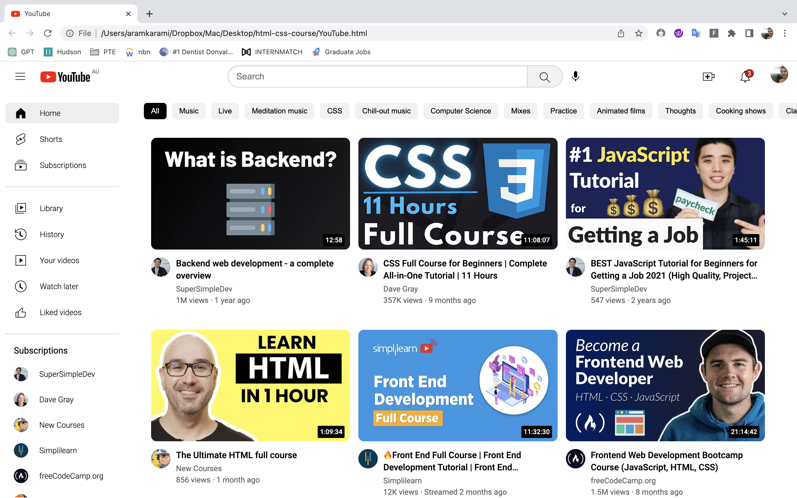

# YouTube-Clone

This project is a practice exercise in HTML and CSS aimed at recreating the design of the YouTube website. It serves as an opportunity to develop your frontend development skills and gain hands-on experience in building responsive and visually appealing web pages.

## Description

The YouTube Clone Project aims to replicate the core features and design elements of the YouTube website. By working on this project, you will gain a deeper understanding of HTML and CSS, as well as improve your proficiency in layout structuring, styling, and responsive design techniques.

## Features

- Home page with a video grid layout
- Header with logo, search box, and user profile information.
- Sidebar with navigation links and subscribed channels.
- Tabs for different categories of videos.
- Video previews with thumbnail, duration, and author information.
- Responsiveness: The website is designed to be responsive, ensuring a seamless experience across various screen sizes and devices. It dynamically adjusts the layout, font sizes, and element positioning to provide optimal viewing and interaction on desktops, laptops, tablets, and mobile devices.

## Technologies Used

- HTML: Used for structuring the web pages and organizing the content.
- CSS: Used for styling the user interface and applying visual effects.

## Getting Started

To get started with the YouTube Clone Project, follow these steps:

1. Clone or download the project files from the repository.
2. Open the project directory in your preferred code editor.
3. Explore the HTML files and CSS stylesheets to understand the structure and design of the YouTube website.
4. Make changes and modifications to the HTML and CSS files to match the YouTube website design.
5. Use the browser's live preview or open the HTML files in your web browser to see the changes in real-time.
6. Experiment with different HTML tags, CSS properties, and layout techniques to improve your skills and achieve a closer resemblance to the original YouTube design.
7. Feel free to customize and personalize the project to add your own touch and creativity.

## Screenshots

> This screenshot shows the main page of the YouTube clone website with the header, sidebar, tabs, and video previews.

## Contributing

Contributions are welcome! If you find any issues or have suggestions for improvements, please open an issue or submit a pull request.

## Acknowledgments

- The YouTube website for inspiration.

## Contact

For any inquiries or feedback, please contact Fatemeh Karami (karami.f@gmail.com).
